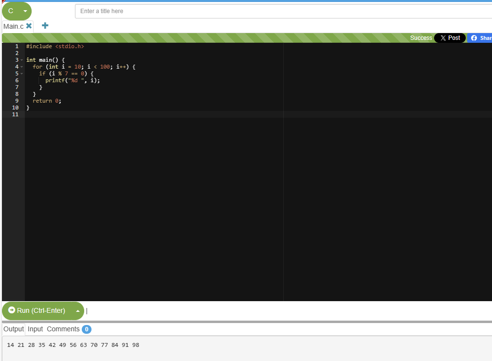
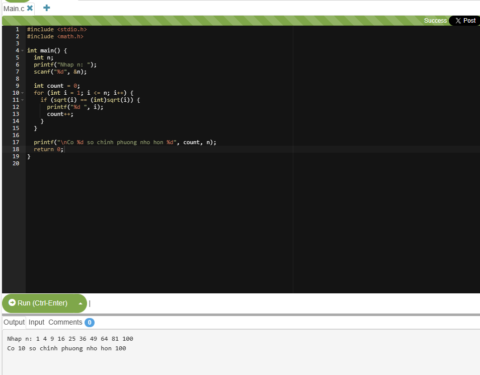
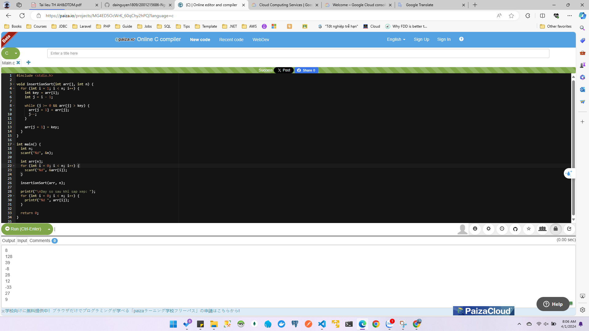
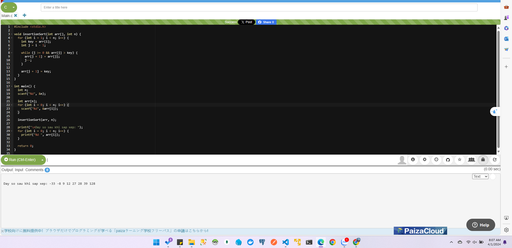
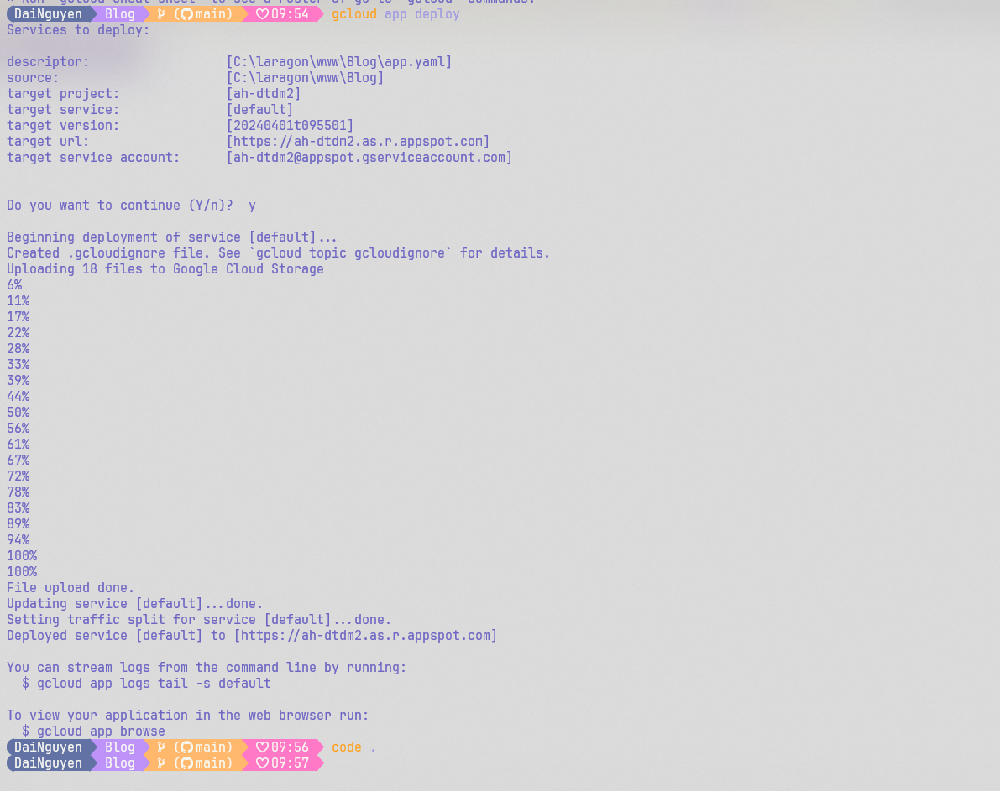
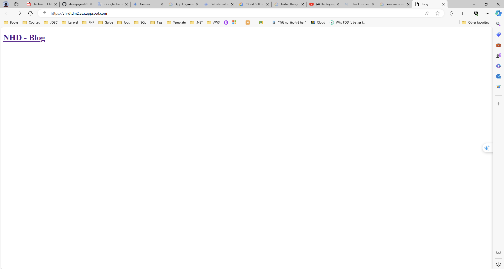

#### Giải thuật Banker

#### Bài 1: Sử dụng hàm trong ngôn ngữ C, viết chương trình xuất các số nguyên có 2 chữ số và là bội của 7.

#### Bài 2: Viết chương trình đếm và in ra các số chính phương nhỏ hơn n với n là số nguyên dương nhập từ bàn phím. Yêu cầu viết hàm kiểm tra số chính phương và hàm đếm số chính phương. Biết rằng số chính phương là số khi lấy căn bặc 2 có kết quả là nguyên. Ví dụ: với n=50, xuất ra màn hình 7 số chính phương là: 49, 36, 25, 16, 9, 4, 1.

#### Bài 3: Viết chương trình cho phép nhập vào n số nguyên. Sau đó thực hiện sắp xếp dãy số nguyên đó theo thứ tự bằng 1 trong các thuật toán sắp xếp đã học: Insertion Sort, Selection Sort, Bubble Sort, Merge Sort.

##### input

##### output

#### Bài thực hành 4: Sử dụng Google App Engine

##### Deploy

##### Ket qua

